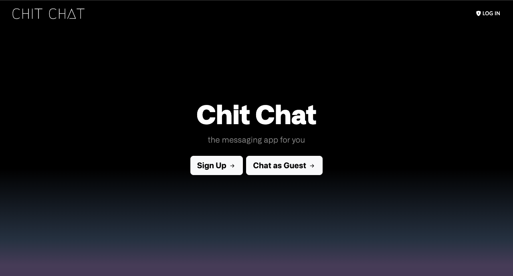
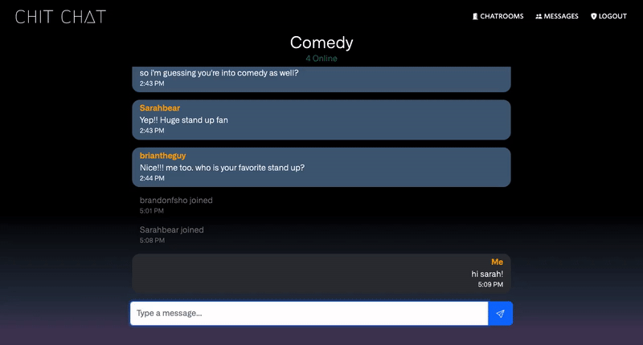
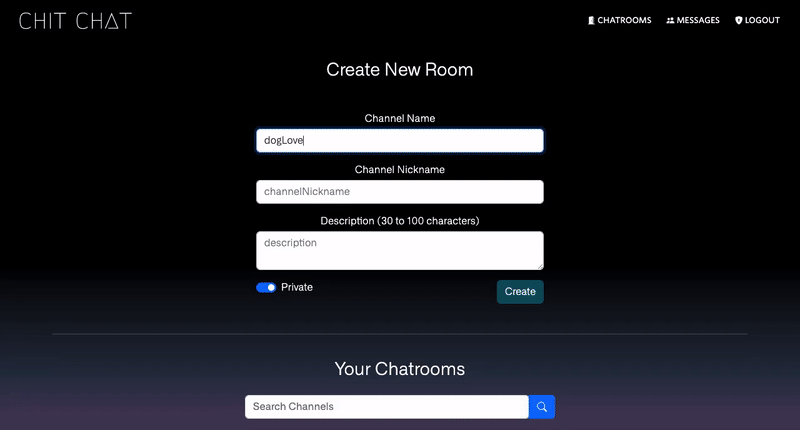
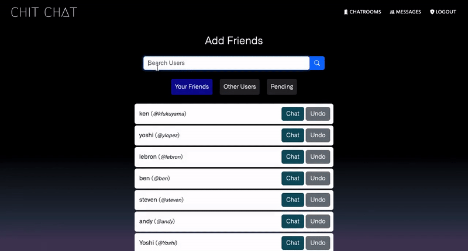
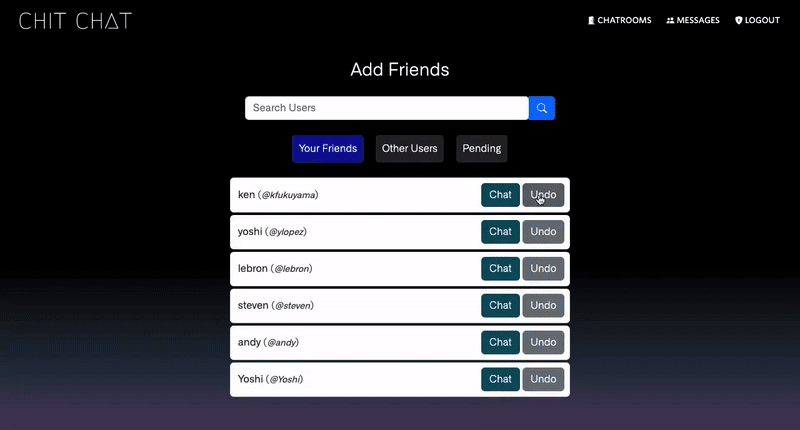

# Chit Chat

A full-stack instant-messaging application created with Java Spring Boot, WebSocket, and MySQL.

Sign in as a guest user or regular user (email required) and talk in public chatrooms! Clients can choose from many channels to connect with others. Channel previews display the ten most recent messages of each channel! Live search is enabled on multiple pages for quick and easy access.

Once in a room, users are free to chat with other users. WebSocket provides instant responses without the need to refresh the page!

If users are signed up with an email, they are able to create their own public or private channels! They have the ability to edit or delete these channels. 

Users signed up with an email may also connect with other users via friend request! You may request a connection with a user, but you will not be able to message them privately until the request has been approved. Users are able to add and remove friends, as well as undo any sent requests.

Once a friend request has been approved, you are able to privately message with that user! The messages/DM page provides the user a way to manage their private messages with all of their friends. The dashboard displays the newest messages in descending order for easy access to their close friends.

  MIT License - Copyright © 2022 Ken Fukuyama & Brandon Taylor 

